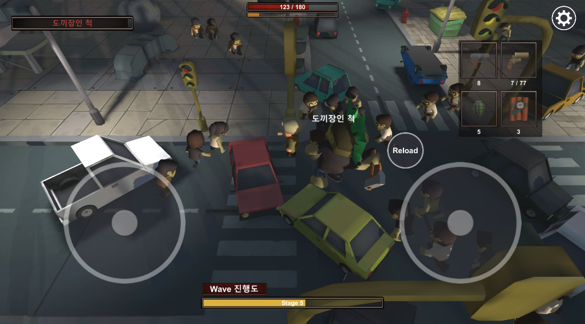
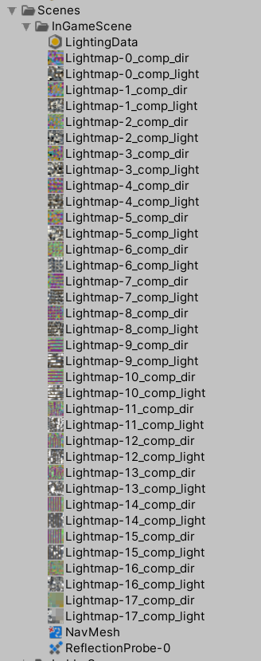
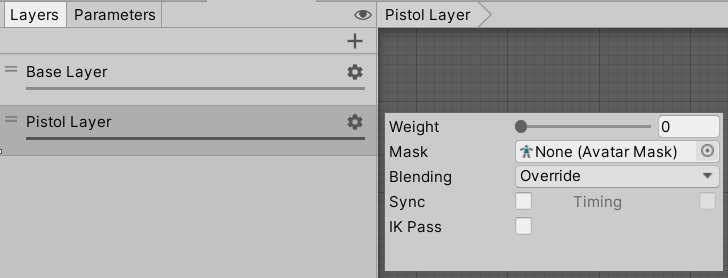
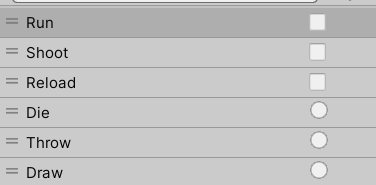

# 좀비 학살자 (Zombie Slayer)
- 제작 기간: 일주일

</img>

## 플레이 영상
- [플레이 영상](https://blog.naver.com/zoqxlstm6/222014139770)

## 프로젝트 소개
- 여러 종류의 총기를 사용하여 좀비를 처지하는 슈팅 게임입니다. 3스테이지마다 다른 특징을 가진 6종류의 좀비들이 등장하며, 5스테이지 마다 보스 좀비가 등장합니다.  Zombie War 소스를 활용하여 싱글게임으로 소스를 개량하고 좀비의 유형과 총기의 유형, 아이템, 코스튬, 능력치 등을 추가하여 모바일 환경으로 구동되도록 구성하였습니다.

## 주요 기능 소개
- Gun 스크립트를 상속하는 다양한 총기 구현
- Enemy 스크립트를 상속하는 다른 특징을 가진 좀비 구현
- 보스 구현
- 보조무기와 주무기 스왑 시스템 구현
- 수류탄 투척, TnT 설치 시스템 구현
- 총기, 아이템, 버프, 코스튬 상점 구현
- 버프 시스템 구현
- 모바일 최적화를 위해 라이트맵 활용
- 최적화를 위해 몬스터, 총알, 이펙트 등 오브젝트 풀 구현
- 개인의 기록을 10개까지 저장하는 순위 시스템 구성
- 사운드 on/off UI 구현
- 아이템 획득 시스템 구현
- 조이스틱을 이용한 플레이어 이동 및 회전 구현
- 재장전 시스템 구현
- Wave 시스템 구현
- 게임 오버 UI 구현
- 애니메이터의 layer의 weight 속성을 이용한 보조무기를 착용했을 때와 주무기를 착용했을 때의 애니메이션 변경 구현
- 선택된 총기, 코스튬 장착 구현
- Json을 사용한 게임 데이터 저장

## 추가 설명
### Gun 스크립트를 이용한 다양한 총기
- 보조무기와 주무기 모두 Gun 스크립트를 상속받고 발사 함수만 Override 하여 사용하였습니다.
### Enemy 스크립트를 이용한 다양한 좀비
- 좀비들은 Enemy 스크립트를 상속받아 필요한 부분만을 Override 하여 사용하였습니다. 
### 라이트맵 활용
- 모바일 최적화를 위해 라이트 스태틱을 적용하여 라이트맵을 Bake하여 사용하였습니다.   
</img>

### 보조무기와 주무기 애니메이션 분리
- 보조무기와 주무기를 처리하는 다른 애니메이션 적용을 위해 Animator의 Layer를 분리하여 사용하는 Layer의 Weight를 주어 서로 다른 애니메이션이 구동되도록 하였습니다. Weight 값을 통해 보조무기와 주무기의 서로 다른 애니메이션을 처리하고 Parameter는 공유하여 사용하였습니다.
    - Layers   
    </img>
    - Parameters  
    </img>

### 순위 시스템
- 순위 정보는 10개까지 저장이 가능하며, 리스트에 저장하여 내림차순 정렬을 하는 방식으로 구현하였습니다. 리스트의 count가 10이 넘어간다면 내림차순으로 정렬된 데이터 중 가장 마지막 데이터를 삭제합니다.
- 순위 버튼이 눌린 경우 RankSlot 프리팹을 이용하여 오브젝트를 생성하여 순위 슬롯을 추가 해주도록 하였습니다. 생성된 순위 슬롯에는 리스트에 저장된 데이터가 순차적으로 들어가게됩니다.

> SaveData.cs
```c#
/// <summary>
/// 랭킹 데이터 클래스
/// </summary>
[System.Serializable]
public class RankData
{
    public int stageCount;     // 진행한 스테이지
    public int goldCount;      // 획득한 골드
    public int killCount;      // 사살한 좀비 수

    public RankData(int stageCount, int goldCount, int killCount)
    {
        this.stageCount = stageCount;
        this.goldCount = goldCount;
        this.killCount = killCount;
    }
}

public class SaveData
{
    // 생략

    public List<RankData> rankDatas = new List<RankData>(); // 랭킹 데이터

    /// <summary>
    /// 랭킹데이터 정렬
    /// </summary>
    public void RankDataSort()
    {
        // 킬카운트를 기준으로 내림차순으로 정렬
        rankDatas.Sort(delegate (RankData a, RankData b) { return b.killCount - a.killCount; });
    }
}
```
> GameOverPanel.cs
```c#
/*
 * 게임 오버시 순위 데이터 저장
*/

// 랭킹 데이터 저장
saveData.rankDatas.Add(new RankData(
    spawnManager.Wave.stageCount - 1,
    gameAccumulator.Gold,
    player.KillCount
));
// 랭킹 데이터 내림차순 정렬
saveData.RankDataSort();
// 데이터가 10개를 초과한 경우 가장 마지막 데이터 제거
if (saveData.rankDatas.Count > 10)
    saveData.rankDatas.RemoveAt(saveData.rankDatas.Count - 1);
```

### 아이템 구매 정보 관리
- 아이템 구매 정보를 관리하기 위해 리스트를 사용하였습니다. 구매가능한 아이템의 인덱스를 리스트에 넣고 구매가 완료되었을 때 해당 아이템의 인덱스를 제거하는 방식으로 구매 정보를 관리했습니다.
> SaveData.cs
```c#
public class SaveData
{
    // 생략

    public List<int> buyableGuns = new List<int>();         // 구매가능한 총기 리스트
    public List<int> buyableModels = new List<int>();       // 구매가능한 모델 리스트

    public SaveData()
    {
        ///---------------------------
        /// 구매한 아이템은 리스트에서 인덱스를 제거한다.
        ///---------------------------

        // 구매 가능한 총기 인덱스 초기화
        for (int i = 0; i < 18; i++)
        {
            buyableGuns.Add(i);
        }
        // 다운로드 후 첫 시작 시 주어지는 총기 인덱스 제거
        buyableGuns.Remove(0);

        // 구매 가능한 모델 인덱스 초기화
        for (int i = 0; i < 19; i++)
        {
            buyableModels.Add(i);
        }
        // 다운로드 후 첫 시작 시 주어지는 모델 인덱스 제거
        buyableModels.Remove(0);
    }
}
```

### 보조무기와 주무기 모델 교체
- 장착 무기 교체 시 상속받은 클래스를 is 연산자로 확인하여 보조무기인지 주무기인지 확인하고 해당 무기를 새로운 무기 모델로 교체해 주고 무기에 맞는 애니메이터 Layer를 지정하는 방식으로 구현하였습니다.
> DisplayModel.cs
```c#
/// <summary>
/// 총기 모델 교체 함수
/// </summary>
/// <param name="selectGunIndex">교체할 총기 인덱스</param>
public void ChangedGunModel(int selectGunIndex)
{
    // 게임 매니저 캐싱
    GameManager gameManager = GameManager.Instance;

    // 변경할 총기 오브젝트 생성
    GameObject go = Instantiate(gameManager.GunModels[selectGunIndex]);
    // 부모 지정
    if(go != null)
        go.transform.SetParent(transform);

    Gun newGun = go.GetComponent<Gun>();
    if(newGun != null)
    {
        // 장착 중인 총기 비활성 및 장착총기 NULL값 초기화
        SetActivatedGunModel(EquipGun.gameObject, false);
        EquipGun = null;

        // 보조무기인 경우
        if (newGun is Pistol)
        {
            // 선택된 총기 인덱스 저장
            gameManager.DataBase.SaveData.subGunIndex = selectGunIndex;

            // 보조무기 교체
            if (SubGun != null)
                Destroy(SubGun.gameObject);
            SubGun = newGun;

            // 무기에 따른 애니메이션 셋 변경
            SetBaseAnimation(WeaponStyle.PISTOL);
        }
        else // 주무기인경우
        {
            // 선택된 총기 인덱스 저장
            gameManager.DataBase.SaveData.mainGunIndex = selectGunIndex;

            // 주무기 교체
            if (MainGun != null)
                Destroy(MainGun.gameObject);
            MainGun = newGun;

            // 무기에 따른 애니메이션 셋 변경
            SetBaseAnimation(WeaponStyle.WEAPON);
        }

        // 총꺼내는 애니메이션 재생
        Animator.PlayAnimator(AnimationConstantName.DRAW);

        // 장착 총기 설정
        EquipGun = newGun;
    }

    // 저장
    gameManager.DataBase.Save();

    // 장착 슬롯 UI 변경
    EquipSlotPanel equipSlotPanel = PanelManager.GetPanel(typeof(EquipSlotPanel)) as EquipSlotPanel;
    equipSlotPanel.ChangedEquipSlot(this);
}
```
### 코스튬 모델 교체
- 코스튬 장착 버튼이 눌렸을 때, 생성되어있는 디스플레이 객체을 삭제하고, 게임 시작시 실행되는 총기 및 코스튬 모델을 초기화하는 함수를 실행하는 것으로 현재 착용중인 캐릭터 모델, 보조무기 모델, 주무기 모델을 장착할 수 있도록 처리하였습니다.
> ModelShopPanel.cs
```c#
/// <summary>
/// 모델 장착 실행 함수
/// </summary>
public void OnEquipModel()
{
    // 생략

    // 선택된 모델 인덱스 저장
    saveData.modelIndex = selectModelIndex;
    GameManager.Instance.DataBase.Save();

    // 전시된 모델 제거
    LobbySceneManager lobbySceneManager = GameManager.Instance.GetCurrentSceneManager<LobbySceneManager>();
    Destroy(lobbySceneManager.DisplayPlayer.gameObject);

    // 선택된 모델 인덱스로 전시 모델 생성
    GameObject go = Instantiate(lobbySceneManager.Model, Vector3.zero, Quaternion.identity);
    lobbySceneManager.DisplayPlayer = go.GetComponent<DisplayModel>();

    // 캐릭터 모델, 주무기, 보조무기 설정
    lobbySceneManager.DisplayPlayer.SetPlayer(saveData.modelIndex, saveData.mainGunIndex, saveData.subGunIndex, new Quaternion(0, 180, 0, 0));

    // 모델 상점 패널 비활성화
    Close();
}
```
> Player.cs
```c#
/// <summary>
/// 처음 시작시 플레이어 모델 및 무기 설정
/// </summary>
/// <param name="modelIndex">설정할 모델 인덱스</param>
/// <param name="mainGunIndex">설정할 주무기 인덱스</param>
/// <param name="subGunIndex">설정할 보조무기 인덱스</param>
/// <param name="generateModelRot">생성시 회전값</param>
public void SetPlayer(int modelIndex, int mainGunIndex, int subGunIndex, Quaternion generateModelRot)
{
    GameManager gameManager = GameManager.Instance;

    // 시작 캐릭터 모델 생성 및 설정
    model = Instantiate(gameManager.Models[modelIndex], Vector3.zero, generateModelRot);
    model.transform.SetParent(transform);

    GameObject go = null;

    // 보조무기 생성
    go = Instantiate(gameManager.GunModels[subGunIndex], transform);

    // 보조무기 설정
    subGun = go.GetComponent<Gun>();
    if (subGun != null)
    {
        equipGun = subGun;
    }

    // 주무기가 구입된 상태인지 확인
    if (mainGunIndex != -1)
    {
        // 주무기 생성
        go = Instantiate(gameManager.GunModels[mainGunIndex], transform);

        // 주무기 설정
        mainGun = go.GetComponent<Gun>();
        if (mainGun != null)
        {
            // 주무기가 있다면 장착
            equipGun = mainGun;
        }  
    }

    // 애니메이터 아바타 설정
    SetAvatar(avatar);

    // 장착 슬롯 UI 변경
    EquipSlotPanel equipSlotPanel = PanelManager.GetPanel(typeof(EquipSlotPanel)) as EquipSlotPanel;
    equipSlotPanel.ChangedEquipSlot(this);

    // 착용무기가 보조무기인지 확인
    if (equipGun is Pistol)
    {
        // 무기에 따른 애니메이션 설정
        SetBaseAnimation(WeaponStyle.PISTOL);
        return;
    }

    SetBaseAnimation(WeaponStyle.WEAPON);
}

/// <summary>
/// 애니메이터 아바타 설정 함수
/// </summary>
void SetAvatar(Avatar avatar)
{
    Animator.GetAnimator.avatar = avatar;
}

/// <summary>
/// 무기에 따른 애니메이션 출력 구분 함수
/// </summary>
/// <param name="weaponStyle">무기 종류</param>
public void SetBaseAnimation(WeaponStyle weaponStyle)
{
    // 무기 상태 변경
    weaponState = weaponStyle;

    // 무기 종류 비교
    switch (weaponStyle)
    {
        // 라이플인 경우 
        case WeaponStyle.WEAPON:
            Animator.GetAnimator.SetLayerWeight(1, 0f);
            break;
        // 피스톨인 경우
        case WeaponStyle.PISTOL:
            Animator.GetAnimator.SetLayerWeight(1, 1f);
            break;
    }
}
```
### 장착 무기 스왑
- 게임 플레이 중 보조무기와 주무기의 스왑을 위해 EquipSlotPanel 스크립트에서 선택된 무기 인덱스를 얻어와 인덱스에 따라 보조무기와 주무기 중 선택된 무기로 스왑하도록 구현하였습니다.
> EquipSlotPanel.cs
```c#
/// <summary>
/// 장착 슬롯 버튼을 누를 때 인덱스에 맞는 기능 실행
/// </summary>
/// <param name="index">스왑할 무기 인덱스</param>
public void OnEquipSlotBtn(int index)
{
    // 버튼음 재생
    GameManager.Instance.SoundManager.PlaySFX(AudioNameConstant.BUTTON_SOUND);

    player.SwapWeapon(index);
}
```
> Player.cs
```c#
/// <summary>
/// 무기 스왑
/// </summary>
/// <param name="index">스왑할 무기 인덱스</param>
public void SwapWeapon(int index)
{
    // 재장전 중일 때는 리턴
    if (state == MotionState.RELOAD)
        return;

    state = MotionState.SWAP;

    // 0: 보조무기 인덱스
    // 1: 주무기 인덱스
    switch (index)
    {
        case 0:
            // 무기에 따른 애니메이션 셋 변경
            SetBaseAnimation(WeaponStyle.PISTOL);

            // 총꺼내는 애니메이션 재생
            Animator.PlayAnimator(AnimationConstantName.DRAW);

            // 보조무기 활성화
            subGun.gameObject.SetActive(true);
            // 주무기가 있다면 비활성화
            if (mainGun != null)
                mainGun.gameObject.SetActive(false);

            // 장착 총기 변경
            equipGun = subGun;
            break;
        case 1:
            // 주무기가 없다면 리턴
            if (mainGun == null)
                return;

            // 무기에 따른 애니메이션 셋 변경
            SetBaseAnimation(WeaponStyle.WEAPON);

            // 총꺼내는 애니메이션 재생
            Animator.PlayAnimator(AnimationConstantName.DRAW);

            // 주무기 활성화, 보조무기 비활성화
            mainGun.gameObject.SetActive(true);
            subGun.gameObject.SetActive(false);

            // 장착 총기 변경
            equipGun = mainGun;
            break;
    }

    state = MotionState.NONE;
}
```
### 스테이지 Wave 관리
- Wave 클래스를 이용해 Wave에 필요한 정보를 정의하고, OnCheckWaveClear()함수를 통해 한 스테이지가 클리어되었는지 체크하면서 스테이지가 클리어되었을 때 다음 Wave 정보를 정의하고 다음 스테이지로 넘어가도록 구현하였습니다.
> SpawnManager.cs
```c#
/// <summary>
/// 웨이브 데이터
/// </summary>
[System.Serializable]
public class Wave
{
    public EnemyGradeData[] gradeEnemyData; // 등급에 따른 에너미 데이터
    public int spawnCount;                  // 한번에 스폰될 양
    public int waveCount;                   // 진행될 웨이브 카운트
    public int addSpawnCount;               // 스테이지마다 늘어날 스폰 수
    public int spawnTime;                   // 주기적 스폰 시간
    public int stageFactor;                 // 좀비 등급 상승 팩터
    public int bossSpawnFactor;             // 보스 등장 팩터

    public int stageCount;                  // 진행 스테이지

    public int enemyGradeSpawnIndex;        // 생성할 등급까지의 인덱스
    public int remainEnemyCount;            // 남아있는 에너미 수
    public int stageInKillCount;            // 한 스테이지 내에서 죽인 수
}
```
```c#
/// <summary>
/// 웨이브를 모두 클리어했는지 검사하는 함수
/// </summary>
public void OnCheckWaveClear()
{
    // 남은 에너미 수 감소 처리
    wave.remainEnemyCount--;
    wave.stageInkillCount++;

    // 보스 생성 시점 검사
    BossGenerateCheck();

    // 남은 에너미가 없고 3웨이브를 모두 진행했다면 웨이브정보 초기화 진행
    if (wave.remainEnemyCount <= 0 && wave.waveCount == 0)
    {
        UpdateWaveData();
    }
}

/// <summary>
/// 웨이브 정보 업데이트
/// </summary>
void UpdateWaveData()
{
    isSpawnStart = false;
    isGenerateBoss = false;

    // 스테이지 증가
    wave.stageCount++;

    // 스테이지 특정 단계마다 등급 업된 에너미 출현
    if (wave.stageCount % wave.stageFactor == 0)
    {
        if (wave.enemyGradeSpawnIndex < wave.gradeEnemyData.Length - 1)
            wave.enemyGradeSpawnIndex++;
    }

    // 웨이브 카운트, 남아있는 적 카운트 초기화 및 스폰될 양 증가
    wave.waveCount = 3;
    wave.remainEnemyCount = 0;
    wave.stageInkillCount = 0;
    wave.spawnCount += wave.addSpawnCount;

    // 스폰 알림 메세지 출력
    WavePanel wavePanel = PanelManager.GetPanel(typeof(WavePanel)) as WavePanel;
    wavePanel.ShowNotic(WavePanel.SPAWN_MESSAGE);

    // 웨이브 시작
    StartCoroutine(SpawnDelay());
}

/// <summary>
/// 지정된 시간 딜레이 후 웨이브 시작
/// </summary>
/// <returns></returns>
public IEnumerator SpawnDelay()
{
    yield return new WaitForSeconds(WavePanel.NOTIC_SHOW_TIME);
    SpawnStart();
}
```
### Json을 이용한 파일 저장
- 유니티에서 제공하는 JsonUtility를 사용하여 Json으로 게임데이터를 저장하였습니다. Base64 인코딩 방식으로 저장데이터를 아스키 문자열로 변환 후 저장하여 일반적인 사람은 해석할 수 없도록 했습니다.
> DataBase.cs
```c#
/// <summary>
/// 데이터 저장
/// </summary>
public void Save()
{
    // 쓰기
    using (StreamWriter sw = new StreamWriter(new FileStream(Application.persistentDataPath + "/Data.json", FileMode.Create), Encoding.UTF8))
    {
        string json = JsonUtility.ToJson(saveData, prettyPrint:true);
        // Base64로 인코딩하여 아스키 문자열로 변환
        byte[] bytes = System.Text.Encoding.UTF8.GetBytes(json);
        string codes = System.Convert.ToBase64String(bytes);

        sw.Write(codes);
    }
}

/// <summary>
/// 데이터 불러오기
/// </summary>
public void Load()
{
    // 데이터가 존재하는지 확인
    if(!File.Exists(Application.persistentDataPath + "/Data.json"))
    {
        Debug.Log("세이브 데이터가 없습니다.");

        saveData.modelIndex = startModelIndex;
        saveData.mainGunIndex = startMainGunIndex;
        saveData.subGunIndex = startSubGunIndex;

        // 초기 지급 골드
        saveData.gold += 3000;

        return;
    }

    using (StreamReader sr = new StreamReader(new FileStream(Application.persistentDataPath + "/Data.json", FileMode.Open), Encoding.UTF8))
    {
        string codes = sr.ReadToEnd();
        // 아스키 문자열을 json 문자열로 변환
        byte[] bytes = System.Convert.FromBase64String(codes);
        string json = System.Text.Encoding.UTF8.GetString(bytes);

        saveData = JsonUtility.FromJson<SaveData>(json);
    }
}
```